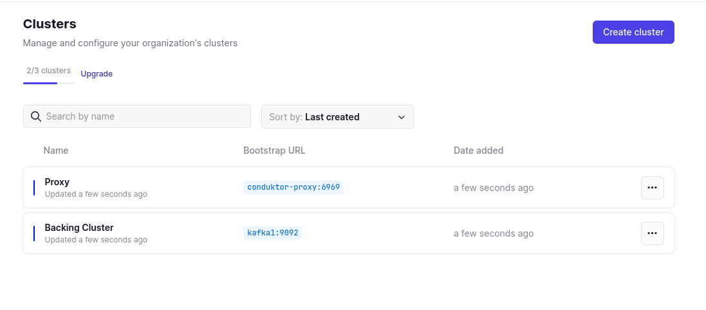
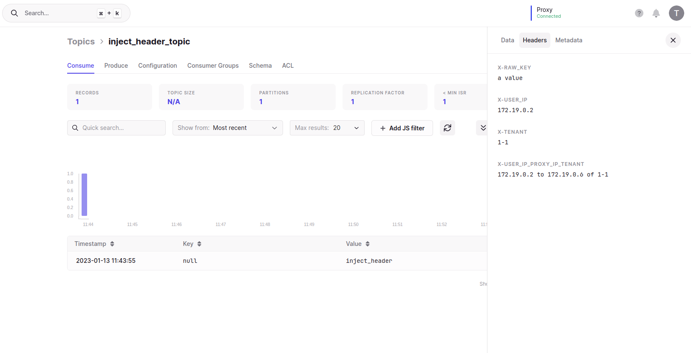
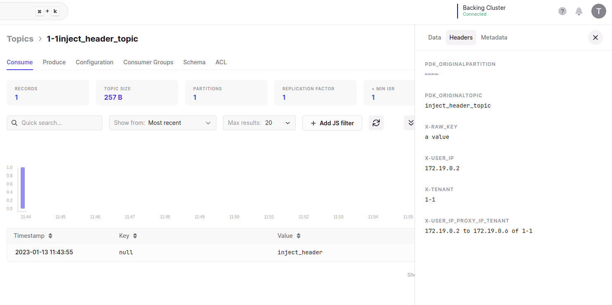
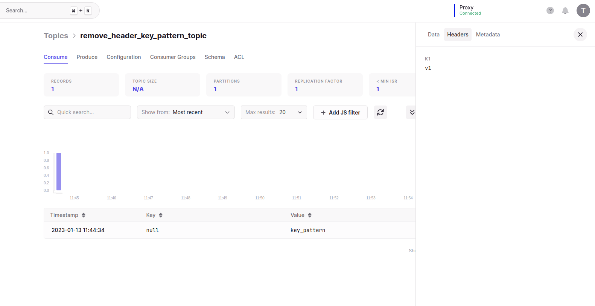
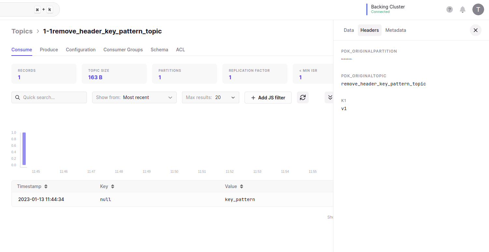
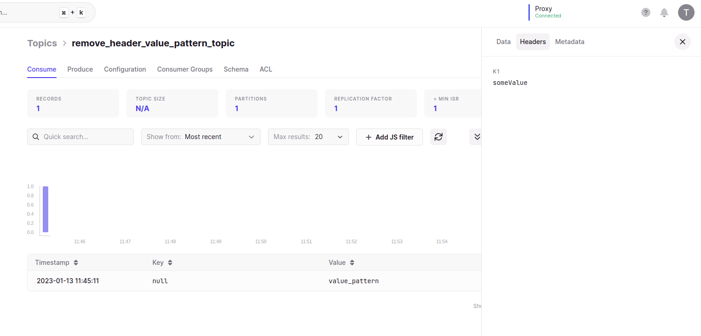
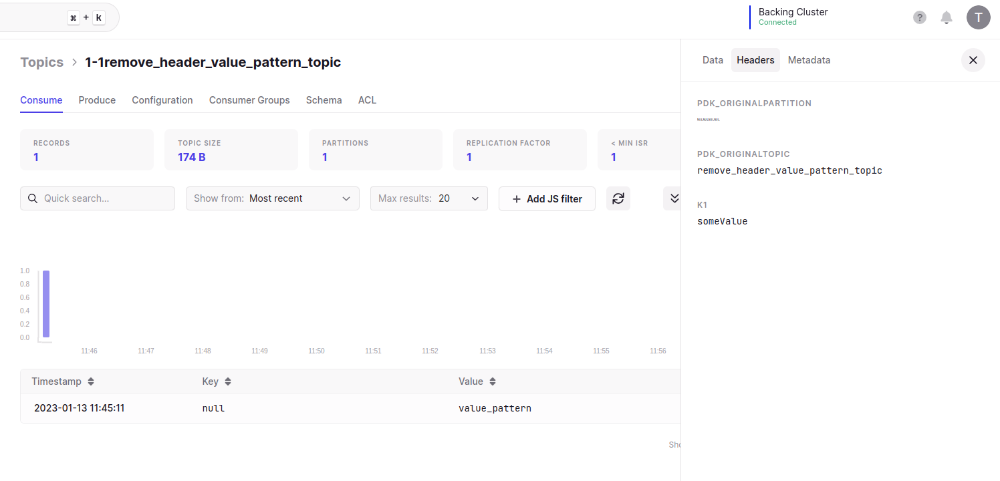
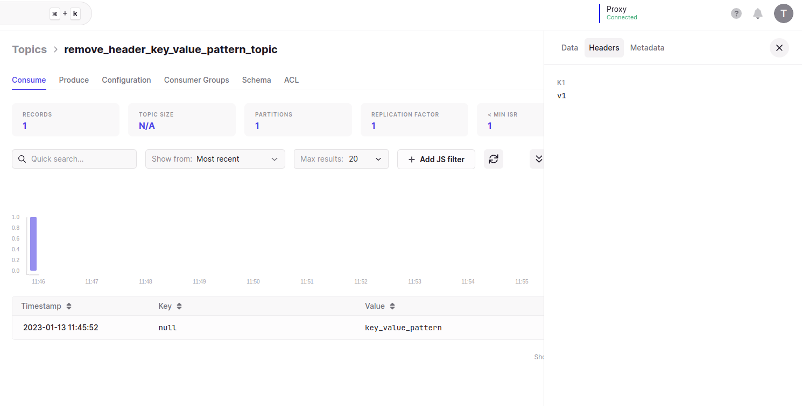
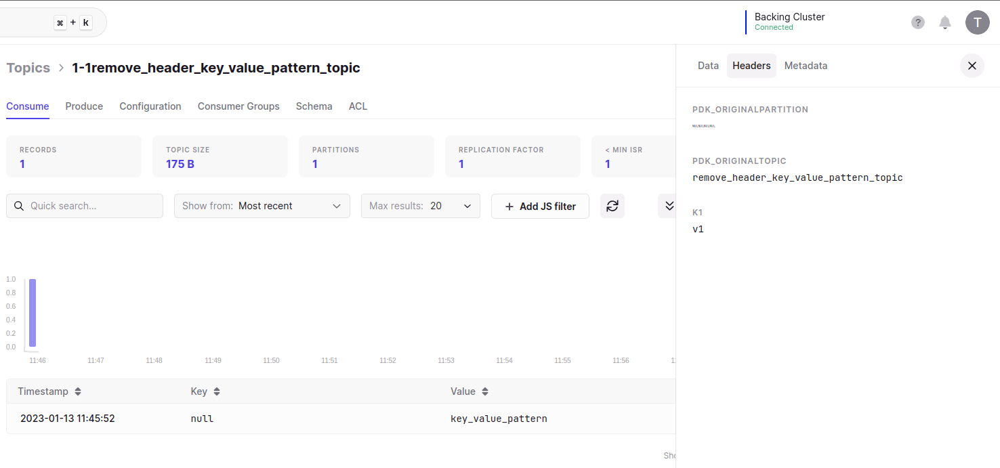

# Conduktor Proxy Inject/Remove Header Demo

## What is Conduktor Proxy Inject/Remove Header?

Conduktor Proxy's inject/remove header feature inject or remove headers of the messages as they are produced through the proxy.

### Video

[](https://asciinema.org/a/fl8Kd5mik36FIQuQzG9EAG8Se)

## Running the demo

Conduktor-Proxy provides a number of different ways to inject/remove headers into your data:

* [Inject Header](#injectHeader)
* [Remove Header With Key Pattern Only](#removeHeaderKeyPatternOnly)
* [Remove Header With Value Pattern Only](#removeHeaderKeyValueOnly)
* [Remove Header With Both Key And Value Pattern](#removeHeaderKeyValuePattern)

### Step 1: Review the environment

As can be seen from `docker-compose.yaml` the demo environment consists of the following:

* A single Zookeeper Server
* A 2 node Kafka cluster
* A single Conduktor Proxy container
* A Conduktor Platform container
* A Kafka Client container (this provides nothing more than a place to run kafka client commands)

### Step 2: Review the platform configuration

`platform-config.yaml` defines 2 clusters:

* Backing Kafka - this is a direct connection to the underlying Kafka cluster hosting the demo
* Proxy - a connection through Conduktor Proxy to the underlying Kafka

Note: Proxy and backing Kafka can use different security schemes. 
In this case the backing Kafka is PLAINTEXT but the proxy is SASL_PLAIN.

### Step 3: Start the environment

Start the environment with

```bash
docker-compose up -d zookeeper kafka1 kafka2 conduktor-proxy kafka-client
```

### Step 4: Create topics

We create topics using the Kafka console tools, the below creates a topic named `inject_header_topic`

```bash
docker-compose exec -T kafka-client \
  kafka-topics \
    --bootstrap-server conduktor-proxy:6969 \
    --command-config /clientConfig/proxy.properties \
    --create --if-not-exists \
    --topic inject_header_topic
```
We create topics using the Kafka console tools, the below creates a topic named `remove_header_key_pattern_topic`

```bash
docker-compose exec -T kafka-client \
  kafka-topics \
    --bootstrap-server conduktor-proxy:6969 \
    --command-config /clientConfig/proxy.properties \
    --create --if-not-exists \
    --topic remove_header_key_pattern_topic
```
We create topics using the Kafka console tools, the below creates a topic named `remove_header_value_pattern_topic`

```bash
docker-compose exec -T kafka-client \
  kafka-topics \
    --bootstrap-server conduktor-proxy:6969 \
    --command-config /clientConfig/proxy.properties \
    --create --if-not-exists \
    --topic remove_header_value_pattern_topic
```
We create topics using the Kafka console tools, the below creates a topic named `remove_header_key_value_pattern_topic`

```bash
docker-compose exec -T kafka-client \
  kafka-topics \
    --bootstrap-server conduktor-proxy:6969 \
    --command-config /clientConfig/proxy.properties \
    --create --if-not-exists \
    --topic remove_header_key_value_pattern_topic
```
List the created topics

```bash
docker-compose exec -T kafka-client \
  kafka-topics \
    --bootstrap-server conduktor-proxy:6969 \
    --command-config /clientConfig/proxy.properties \
    --list
```

### <a name="injectHeader"></a> Step 5: Inject Header

The same REST API can be used to configure the inject header feature. 

The command below will instruct Conduktor Proxy to inject headers with value user ip, tenant and proxy ip in records on topic `inject_header_topic`. 

```bash
docker-compose exec -T kafka-client curl \
    --silent \
    --request POST "conduktor-proxy:8888/tenant/1-1/feature/inject-header" \
    --header 'Content-Type: application/json' \
    --data-raw '{
        "config": {
            "topic": "inject_header_topic",
            "keys": {
              "X-RAW_KEY": "a value",
              "X-USER_IP": "{{userIp}}",
              "X-TENANT": "{{tenant}}",
              "X-USER_IP_PROXY_IP_TENANT": "{{userIp}} to {{proxyIp}} of {{tenant}}"
            }
        },
        "direction": "REQUEST",
        "apiKeys": "PRODUCE"
    }'
```


### Step 6: Produce data to the topic

Let's produce a simple record to the `inject_header_topic` topic.

```bash
echo 'inject_header' | docker-compose exec -T kafka-client \
    kafka-console-producer  \
        --bootstrap-server conduktor-proxy:6969 \
        --producer.config /clientConfig/proxy.properties \
        --topic inject_header_topic
```

### Step 7: Consume from the topic

Let's consume from our `inject_header_topic`.

```bash
docker-compose exec -T kafka-client \
  kafka-console-consumer \
    --bootstrap-server conduktor-proxy:6969 \
    --consumer.config /clientConfig/proxy.properties \
    --topic inject_header_topic \
    --from-beginning \
    --max-messages 1 \
    --property print.headers=true
```

You should see the message with headers as below

```
X-RAW_KEY:a value,X-USER_IP:172.19.0.3,X-TENANT:1-1,X-USER_IP_PROXY_IP_TENANT:172.19.0.3 to 172.19.0.6 of 1-1   inject_header
```

### Step 8: Confirm inject headers at rest

To confirm the message headers are injected in Kafka we can consume directly from the underlying Kafka cluster.

```bash
docker-compose exec -T kafka-client \
  kafka-console-consumer \
    --bootstrap-server kafka1:9092 \
    --topic 1-1inject_header_topic \
    --from-beginning \
    --max-messages 1 \
    --property print.headers=true
```

You should see an output similar to the below:

```
PDK_originalPartition:,PDK_originalTopic:inject_header_topic,X-RAW_KEY:a value,X-USER_IP:172.19.0.2,X-TENANT:1-1,X-USER_IP_PROXY_IP_TENANT:172.19.0.2 to 172.19.0.6 of 1-1      inject_header
```

### <a name="removeHeaderKeyPatternOnly"></a> Step 9: Remove Header With Key Pattern Only

The same REST API can be used to configure the remove header with key pattern only feature.

The command below will instruct Conduktor Proxy to remove headers which key matches the pattern `k0.*'` in records on topic `remove_header_key_pattern_topic`.

```bash
docker-compose exec -T kafka-client curl \
    --silent \
    --request POST "conduktor-proxy:8888/tenant/1-1/feature/remove-header" \
    --header 'Content-Type: application/json' \
    --data-raw '{
        "config": {
            "topic": "remove_header_key_pattern_topic",
            "keyPattern": "k0.*"
        },
        "direction": "REQUEST",
        "apiKeys": "PRODUCE"
    }'
```


### Step 10: Produce data to the topic

Let's produce a simple record to the `remove_header_key_pattern_topic` topic.

```bash
echo 'k0:v0,k1:v1\tkey_pattern' | docker-compose exec -T kafka-client \
    kafka-console-producer  \
        --bootstrap-server conduktor-proxy:6969 \
        --producer.config /clientConfig/proxy.properties \
        --topic remove_header_key_pattern_topic \
        --property parse.key=false \
        --property parse.headers=true
```

### Step 11: Consume from the topic

Let's consume from our `remove_header_key_pattern_topic`.

```bash
docker-compose exec -T kafka-client \
  kafka-console-consumer \
    --bootstrap-server conduktor-proxy:6969 \
    --consumer.config /clientConfig/proxy.properties \
    --topic remove_header_key_pattern_topic \
    --from-beginning \
    --max-messages 1 \
    --property print.headers=true
```

You should see the message with headers as below

```
k1:v1   key_pattern
```

### Step 12: Confirm remove headers with key pattern at rest

To confirm the message headers are removed in Kafka we can consume directly from the underlying Kafka cluster.

```bash
docker-compose exec -T kafka-client \
  kafka-console-consumer \
    --bootstrap-server kafka1:9092 \
    --topic 1-1remove_header_key_pattern_topic \
    --from-beginning \
    --max-messages 1 \
    --property print.headers=true
```

You should see an output similar to the below:

```
PDK_originalPartition:,PDK_originalTopic:inject_header_topic,k1:v1      key_pattern
```

### <a name="removeHeaderValuePatternOnly"></a> Step 13: Remove Header With Value Pattern Only

The same REST API can be used to configure the remove header with value pattern only feature.

The command below will instruct Conduktor Proxy to remove headers which value matches the pattern `value.*'` in records on topic `remove_header_value_pattern_topic`.

```bash
docker-compose exec -T kafka-client curl \
    --silent \
    --request POST "conduktor-proxy:8888/tenant/1-1/feature/remove-header" \
    --header 'Content-Type: application/json' \
    --data-raw '{
        "config": {
            "topic": "remove_header_value_pattern_topic",
            "valuePattern": "value.*"
        },
        "direction": "REQUEST",
        "apiKeys": "PRODUCE"
    }'
```


### Step 14: Produce data to the topic

Let's produce a simple record to the `remove_header_value_pattern_topic` topic.

```bash
echo 'k0:value0,k1:someValue\tvalue_pattern' | docker-compose exec -T kafka-client \
    kafka-console-producer  \
        --bootstrap-server conduktor-proxy:6969 \
        --producer.config /clientConfig/proxy.properties \
        --topic remove_header_value_pattern_topic \
        --property parse.key=false \
        --property parse.headers=true
```

### Step 15: Consume from the topic

Let's consume from our `remove_header_value_pattern_topic`.

```bash
docker-compose exec -T kafka-client \
  kafka-console-consumer \
    --bootstrap-server conduktor-proxy:6969 \
    --consumer.config /clientConfig/proxy.properties \
    --topic remove_header_value_pattern_topic \
    --from-beginning \
    --max-messages 1 \
    --property print.headers=true
```

You should see the message with headers as below

```
k1:someValue   value_pattern
```

### Step 16: Confirm remove headers with value pattern at rest

To confirm the message headers are removed in Kafka we can consume directly from the underlying Kafka cluster.

```bash
docker-compose exec -T kafka-client \
  kafka-console-consumer \
    --bootstrap-server kafka1:9092 \
    --topic 1-1remove_header_value_pattern_topic \
    --from-beginning \
    --max-messages 1 \
    --property print.headers=true
```

You should see an output similar to the below:

```
PDK_originalPartition:,PDK_originalTopic:inject_header_topic,k1:someValue   value_pattern
```

### <a name="removeHeaderKeyValuePattern"></a> Step 17: Remove Header With Both Key And Value Pattern

The same REST API can be used to configure the remove header with both key and value pattern feature.

The command below will instruct Conduktor Proxy to remove headers which key matches the pattern `k0.*'` and value matches the pattern `v0.*`  in records on topic `remove_header_key_value_pattern_topic`.

```bash
docker-compose exec -T kafka-client curl \
    --silent \
    --request POST "conduktor-proxy:8888/tenant/1-1/feature/remove-header" \
    --header 'Content-Type: application/json' \
    --data-raw '{
        "config": {
            "topic": "remove_header_key_value_pattern_topic",
            "keyPattern": "k0.*",
            "valuePattern": "v0.*"
        },
        "direction": "REQUEST",
        "apiKeys": "PRODUCE"
    }'
```


### Step 18: Produce data to the topic

Let's produce a simple record to the `remove_header_key_value_pattern_topic` topic.

```bash
echo 'k0:v0,k1:v1\tkey_value_pattern' | docker-compose exec -T kafka-client \
    kafka-console-producer  \
        --bootstrap-server conduktor-proxy:6969 \
        --producer.config /clientConfig/proxy.properties \
        --topic remove_header_key_value_pattern_topic \
        --property parse.key=false \
        --property parse.headers=true
```

### Step 19: Consume from the topic

Let's consume from our `remove_header_key_value_pattern_topic`.

```bash
docker-compose exec -T kafka-client \
  kafka-console-consumer \
    --bootstrap-server conduktor-proxy:6969 \
    --consumer.config /clientConfig/proxy.properties \
    --topic remove_header_key_value_pattern_topic \
    --from-beginning \
    --max-messages 1 \
    --property print.headers=true
```

You should see the message with headers as below

```
k1:v1   key_value_pattern
```

### Step 20: Confirm inject headers at rest

To confirm the message headers are removed in Kafka we can consume directly from the underlying Kafka cluster.

```bash
docker-compose exec -T kafka-client \
  kafka-console-consumer \
    --bootstrap-server kafka1:9092 \
    --topic 1-1remove_header_key_value_pattern_topic \
    --from-beginning \
    --max-messages 1 \
    --property print.headers=true
```

You should see an output similar to the below:

```
PDK_originalPartition:,PDK_originalTopic:inject_header_topic,k1:v1   key_value_pattern
```

### Step 21: Log into the platform

> The remaining steps in this demo require a Conduktor Platform license. For more information on this [Arrange a technical demo](https://www.conduktor.io/contact/demo)

Once you have a license key, place it in `platform-config.yaml` under the key: `lincense` e.g.:

```yaml
auth:
  demo-users:
    - email: "test@conduktor.io"
      password: "password1"
      groups:
        - ADMIN
license: "eyJhbGciOiJFUzI1NiIsInR5cCI6I..."
```

the start the Conduktor Platform container:

```bash
docker-compose up -d conduktor-platform
```

From a browser, navigate to `http://localhost:8080` and use the following to log in:

Username: test@conduktor.io
Password: password1

### Step 22: View the clusters in Conduktor Platform

From Conduktor Platform navigate to Admin -> Clusters, you should see 2 clusters as below:



### Step 23: View the injected headers messages in Conduktor Platform

Navigate to `Console` and select the `Proxy` cluster from the top right. You should now see the `inject_header_topic` topic and clicking on it will show you an injected headers version of the produced message.



### Step 24: View the injected headers messages in Conduktor Platform

Navigate to `Console` and select the `Backing Cluster` cluster from the top right. You should now see the `1-1inject_header_topic` topic (ignore the 1-1 prefix for now) and clicking on it will show you an injected headers version of the produced message.



### Step 25: View the removed headers by key pattern messages in Conduktor Platform

Navigate to `Console` and select the `Proxy` cluster from the top right. You should now see the `remove_header_key_pattern_topic` topic and clicking on it will show you a removed version of the produced message.



### Step 26: View the removed headers messages in Conduktor Platform

Navigate to `Console` and select the `Backing Cluster` cluster from the top right. You should now see the `1-1remove_header_key_pattern_topic` topic (ignore the 1-1 prefix for now) and clicking on it will show you a removed headers version of the produced message.



### Step 27: View the removed headers by key pattern messages in Conduktor Platform

Navigate to `Console` and select the `Proxy` cluster from the top right. You should now see the `remove_header_value_pattern_topic` topic and clicking on it will show you a removed version of the produced message.



### Step 28: View the removed headers messages in Conduktor Platform

Navigate to `Console` and select the `Backing Cluster` cluster from the top right. You should now see the `1-1remove_header_value_pattern_topic` topic (ignore the 1-1 prefix for now) and clicking on it will show you a removed headers version of the produced message.



### Step 29: View the removed headers by both key and value pattern messages in Conduktor Platform

Navigate to `Console` and select the `Proxy` cluster from the top right. You should now see the `remove_header_key_value_pattern_topic` topic and clicking on it will show you a removed version of the produced message.



### Step 30: View the removed headers messages in Conduktor Platform

Navigate to `Console` and select the `Backing Cluster` cluster from the top right. You should now see the `1-1remove_header_key_value_pattern_topic` topic (ignore the 1-1 prefix for now) and clicking on it will show you a removed headers version of the produced message.


