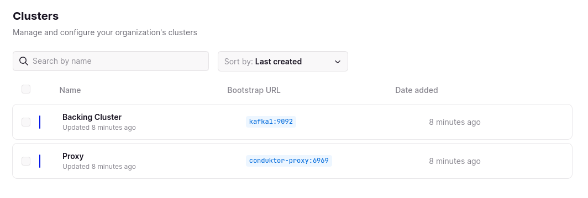

# Create topic Safeguard Demo

In this demo we will impose limits on topic creation to ensure that any topics created in the cluster adhere to a minimum specification for Replication Factor and Partition count.

### Video

[](https://asciinema.org/a/c1jFkzWTrCh9VSF8RO5ezb63R)

## Running the demo

### Step 1: Review the environment

As can be seen from `docker-compose.yaml` the demo environment consists of the following:

* A single Zookeeper Server
* A 2 node Kafka cluster
* A single Conduktor Proxy container
* A Conduktor Platform container
* A Kafka Client container (this provides nothing more than a place to run kafka client commands)

### Step 2: Review the platform configuration

`platform-config.yaml` defines 2 clusters:

* Backing Kafka - this is a direct connection to the underlying Kafka cluster hosting the demo
* Proxy - a connection through Conduktor Proxy to the underlying Kafka

Note: Proxy and backing Kafka can use different security schemes. 
In this case the backing Kafka is PLAINTEXT but the proxy is SASL_PLAIN.

### Step 3: Start the environment

Start the environment with

```bash
docker-compose up -d zookeeper kafka1 kafka2 conduktor-proxy kafka-client
```

### Step 4: Configure safeguard

Conduktor Proxy provides a REST API used to configure the safeguard feature. 

The command below will instruct Conduktor Proxy to enforce a minimum of 2 replicas and 3 partitions for any newly created topics. 

```bash
docker-compose exec kafka-client curl \
    --silent \
    --request POST "conduktor-proxy:8888/tenant/1-1/feature/guard-create-topics" \
    --header 'Content-Type: application/json' \
    --data-raw '{
        "config": { 
            "minNumPartition": 3,
            "maxNumPartition": 3,
            "minReplicationFactor": 2,
            "maxReplicationFactor": 2 
        },
        "direction": "REQUEST",
        "apiKeys": "CREATE_TOPICS"
    }'
```

### Step 5: Attempt to create an invalid topic

Next we try to create a topic with a specification that does not match the above.

```bash
docker-compose exec kafka-client kafka-topics \
    --bootstrap-server conduktor-proxy:6969 \
    --command-config /clientConfig/proxy.properties \
    --create \
    --topic invalidTopic \
    --replication-factor 1 \
    --partitions 1
```

You should see an output similar to the following:

```bash
WARNING: Due to limitations in metric names, topics with a period ('.') or underscore ('_') could collide. To avoid issues it is best to use either, but not both.
Error while executing topic command : The server experienced an unexpected error when processing the request.
[2022-11-17 22:03:16,410] ERROR org.apache.kafka.common.errors.UnknownServerException: The server experienced an unexpected error when processing the request.
 (kafka.admin.TopicCommand$)
```
### Step 6: Create a valid topic

If we modify our command to meet the criteria the topic is created.

```bash
docker-compose exec kafka-client kafka-topics \
    --bootstrap-server conduktor-proxy:6969 \
    --command-config /clientConfig/proxy.properties \
    --create \
    --topic validTopic \
    --replication-factor 2 \
    --partitions 3
```

### Step 7: Log into the platform

> The remaining steps in this demo require a Conduktor Platform license. For more information on this [Arrange a technical demo](https://www.conduktor.io/contact/demo)

Once you have a license key, place it in `platform-config.yaml` under the key: `lincense` e.g.:

```yaml
auth:
  demo-users:
    - email: "test@conduktor.io"
      password: "password1"
      groups:
        - ADMIN
license: "eyJhbGciOiJFUzI1NiIsInR5cCI6I..."
```

the start the Conduktor Platform container:

```bash
docker-compose up -d conduktor-platform
```

From a browser, navigate to `http://localhost:8080` and use the following to log in:

Username: test@conduktor.io
Password: password1

### Step 8: View the clusters in Conduktor Platform

From Conduktor Platform navigate to Admin -> Clusters, you should see 2 clusters as below:



### Step 9: Attempt to create an invalid topic with Conduktor Platform

Navigate to `Console` and select the `Proxy` cluster from the top right. You should now see the `validTopic` created earlier.

Click the `Create Topic` button and fill out the invalid topic details once more:

* name: invalidTopic
* Partitions: 1
* Replication Factor: 1

You should see an error in topic creation as below:


